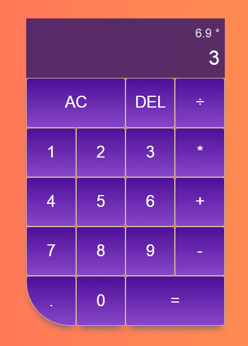

## **"Vanilla-JavaScript-Calculator"**

In this project I´m going to create a simple but modern calculator using ES6 sintax

### **_Concepts Covered:_**

    - How to use ES6 classes to organize code
    - How to sync JavaScript code with a UI
    - CSS Grid
    - Flexbox
    - The best way to cleanly handle user input
    - How to debug complicated edge cases

---

Take a peek at the result:

